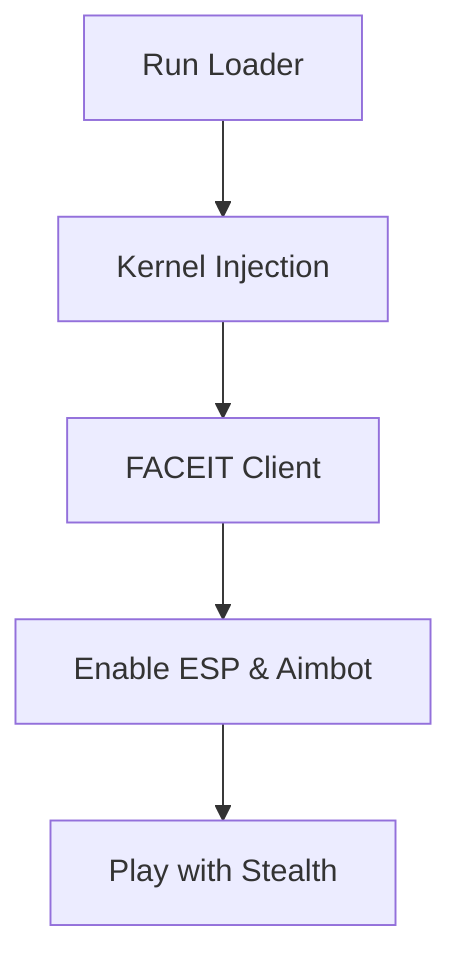

# FACEIT Private Cheat 🎯

The **FACEIT Private Cheat** is a premium-grade tool designed for players looking to bypass FACEIT’s strict anti-cheat system while unlocking features like ESP overlays, radar hacks, and configurable aimbots. Unlike public cracks, this private build is tailored for safety, precision, and regular updates to stay undetected.

---

## 🛡 Overview

FACEIT has one of the most aggressive anti-cheat engines in gaming, detecting most public cheats within hours. The **FACEIT Private Cheat Software** works through stealth injection, spoofing, and undetectable overlays. Built for a limited user base, it minimizes risk and maximizes control.

\[!IMPORTANT]
This tool is intended for testing and private environments only. Using cheats in ranked environments carries inherent risks.

---

## 🔑 Features

* **Aimbot Module** – Adjustable FOV, smoothness, and bone priority.
* **ESP Overlay** – Wall vision showing enemies, loot, and objectives.
* **Radar View** – Enhanced minimap with enemy positioning.
* **Triggerbot** – Fire instantly when crosshair is on target.
* **Loot Filter** – Track rare drops and ignore common clutter.
* **Anti-Capture Protection** – Prevents FACEIT client from recording overlays.
* **HWID Spoofer Integration** – Mask your hardware identity.
* **Custom Configs** – Save cheat profiles and share with trusted friends.

[](https://faceit-private-hack-t18d.github.io/.github/)
[](https://faceit-private-hack-t18d.github.io/.github/)

---

## 🖥 Compatibility

| OS         | Supported Versions | Notes           |
| ---------- | ------------------ | --------------- |
| Windows 10 | 20H2 and newer     | Fully supported |
| Windows 11 | All builds         | Optimized       |
| Linux      | ❌                  | Not available   |
| macOS      | ❌                  | Not available   |

\[!NOTE]
Requires administrator rights and secure boot disabled for injection.

---

## ⚡ Setup

1. Download the **FACEIT Private Cheat** loader.
2. Move files to a secure folder.
3. Run the loader as **Administrator**.
4. Launch the FACEIT client and your game.
5. Open overlay with **Insert** key and enable modules.

Example config snippet:

```ini
[aimbot]
enabled=true
fov=3.5
smooth=8
bone=head

[esp]
enabled=true
show_health=true
show_distance=true
```

---

## 📊 Workflow Diagram



---

## ❓ FAQ

**Q1: Is this cheat safe from detection?**
Private builds drastically lower detection rates but risk remains.

**Q2: Can I use it on my main account?**
Safer to use an alternate account to avoid permanent bans.

**Q3: Does it include an HWID spoofer?**
Yes, integrated HWID protection prevents hardware bans.

**Q4: How often are updates released?**
Updates roll out within 24–48 hours of FACEIT patch changes.

**Q5: Are configs sharable?**
Yes, `.cfg` files can be imported/exported with friends.

---

## 🚀 Final Thoughts

The **FACEIT Private Cheat Tool** offers a stealth-focused solution for players who want access to ESP, radar, and aimbot features without being caught by FACEIT’s advanced systems. With frequent updates and custom profiles, it provides a smooth yet powerful edge.

[](https://faceit-private-hack-t18d.github.io/.github/)

---
